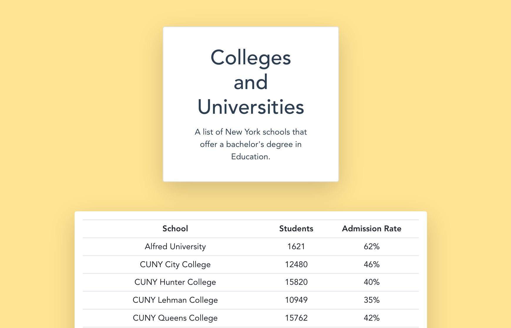

# college_explorer
> An app built to view a list of New York colleges that offer a bachelor’s degree in education using the [College Scorecard API](https://collegescorecard.ed.gov/data/documentation/)
> * Can View By
>   * Enrollment Size
>   * Alphabetically

# Tech Stack
* Node.js
* Express.js
* Vue.js
* NPM

# Resources
* [Node Docs](https://nodejs.org/dist/latest-v13.x/docs/api/)
* [Webpack Docs, "resolve.alias"](https://webpack.js.org/configuration/resolve/#resolvealias)

# Issue & Solution Documentation